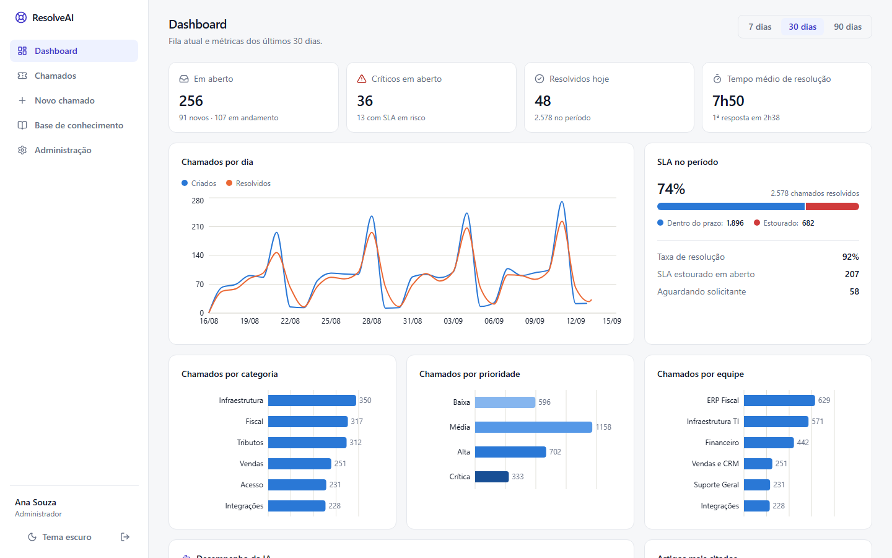
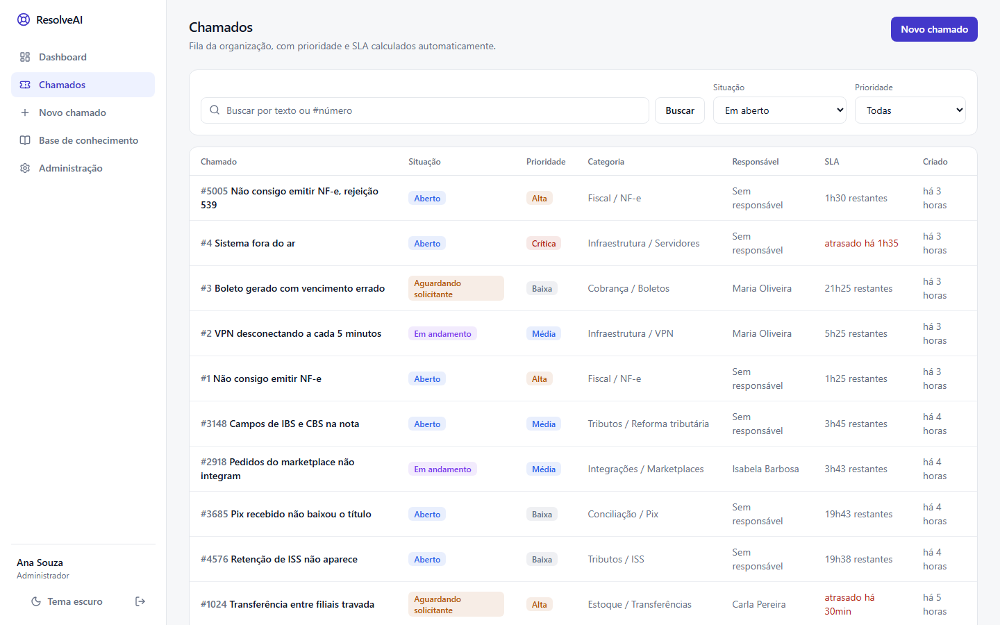
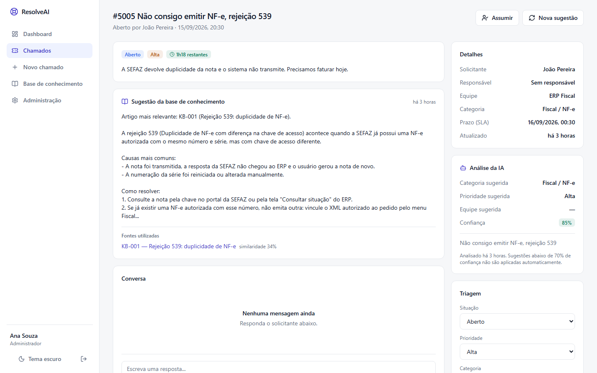
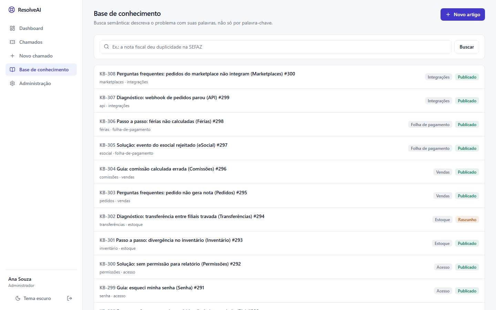
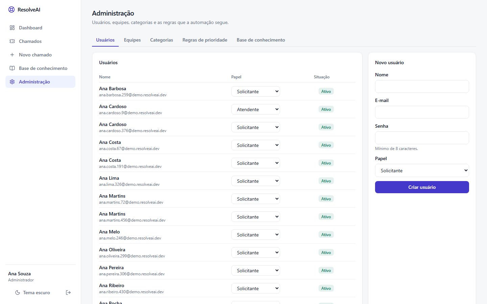

# ResolveAI

**Service desk com inteligência artificial**: recebe chamados, classifica, define prioridade, encaminha para a equipe certa e sugere a solução com base na base de conhecimento, citando as fontes.

> AI-powered service desk that automatically classifies, prioritizes and routes support tickets while generating context-aware solutions using RAG.

Projeto full stack completo: API em **Python/FastAPI** com **PostgreSQL + pgvector**, frontend em **React + TypeScript**, IA com **Claude** e busca semântica com **embeddings + RAG**. Roda inteiro com `docker compose up`.

### 🔗 Demonstração ao vivo

**Aplicação:** https://resolveai-silk.vercel.app · **API e documentação:** https://resolveai-api-wb7q.onrender.com/docs

Entre com `admin@resolveai.dev` / `resolveai123` (ou `agent@` para a visão de atendente e `user@` para a de solicitante). A base tem 5.000 chamados de demonstração.

> A API roda no plano gratuito do Render e **hiberna quando fica sem uso**: a primeira chamada pode levar até um minuto para responder. Depois disso fica rápida.



## Índice

[Demonstração](#demonstração) · [Funcionalidades](#funcionalidades) · [Como a IA funciona](#como-a-ia-funciona) · [Base de conhecimento e RAG](#base-de-conhecimento-e-rag) · [Arquitetura](#arquitetura) · [Stack](#stack) · [Instalação](#instalação) · [Deploy](#deploy) · [Variáveis de ambiente](#variáveis-de-ambiente) · [Testes](#testes) · [API](#api) · [Roadmap](#roadmap)

## Demonstração

| Chamados | Detalhe do chamado |
| --- | --- |
|  |  |

| Base de conhecimento | Administração |
| --- | --- |
|  |  |

Tema escuro: [dashboard](docs/screenshots/dashboard-escuro.png) · [chamado](docs/screenshots/chamado-detalhe-escuro.png)

**Logins de demonstração** (senha `resolveai123`): `admin@resolveai.dev` · `agent@resolveai.dev` · `user@resolveai.dev`

## Funcionalidades

**Chamados**
- Abertura, acompanhamento, comentários e notas internas (invisíveis ao solicitante)
- Triagem: status, prioridade, categoria, equipe e responsável
- Busca por texto ou `#número`, filtros por situação, prioridade, categoria, equipe, responsável e data
- **SLA por prioridade** (24h / 8h / 4h / 1h) com prazo, tempo restante e marcação de estouro
- **Fechamento pelo solicitante ou pela equipe**, e **automático 5 dias depois de resolvido** se ninguém fechar
- Histórico completo de auditoria, incluindo o que a automação fez

**Inteligência artificial**
- Classificação automática: categoria, subcategoria, equipe, prioridade, urgência, resumo e **confiança**
- **Regras de prioridade** configuráveis pelo admin, combinadas com a IA
- Roteamento para a equipe responsável
- Sugestão de solução a partir da base de conhecimento, **citando os artigos usados**

**Base de conhecimento**
- Artigos com categoria, tags e status (rascunho, publicado, arquivado)
- **Busca semântica** com embeddings e pgvector
- Reindexação sob demanda

**Administração e acesso**
- Três papéis: administrador, atendente e solicitante (RBAC)
- Multi-tenant: cada organização só enxerga os próprios dados
- Autenticação JWT com refresh e senhas em Argon2

**Dashboard**
- Não resolvidos, críticos não resolvidos, resolvidos hoje, SLA em risco e prazo estourado
- Tempo médio de primeira resposta e de resolução, taxa de resolução
- Chamados por dia, categoria, prioridade e equipe
- Métricas da IA: aceitação da categoria e da prioridade, confiança média, artigos mais citados

## Como a IA funciona

```
Chamado criado
  ├─ Regras de prioridade (palavras-chave)  ┐ síncrono, já vem na resposta da API
  ├─ Roteamento pela categoria              ┘
  └─ Em segundo plano:
       ├─ Classificação por IA  → sugestão gravada + aplicada se confiança ≥ 0,7
       └─ Busca na base (RAG)   → sugestão de solução com fontes citadas
```

Regras que tornam a automação segura:

- **A IA só preenche campos vazios** e **nunca sobrescreve o que um atendente alterou** (verificado no histórico).
- **A regra de prioridade é um piso:** a IA pode subir a prioridade, nunca baixar.
- **A equipe padrão da categoria vence** a equipe sugerida pela IA.
- **Nomes inventados são descartados:** categoria, subcategoria e equipe precisam existir no catálogo da organização.
- **A resposta só cita artigos que a busca recuperou**; sem artigo relevante, a sugestão diz que a base não cobre o chamado.
- **Falha da IA não bloqueia nada:** o chamado é criado, as regras funcionam e a falha fica registrada.
- **O texto do chamado é tratado como dado**, e o prompt manda ignorar instruções que venham dentro dele (prompt injection).

**Provedores intercambiáveis.** O padrão é gratuito e roda offline; a IA de verdade é opcional:

| Função | Padrão (grátis) | Opcional |
| --- | --- | --- |
| Classificação | palavras-chave do catálogo | **Claude** (`claude-haiku-4-5`), saída estruturada |
| Embeddings | hashing local de palavras | **Voyage AI** (`voyage-4-lite`) |
| Resposta | trecho do artigo mais relevante | **Claude**, resposta escrita a partir dos artigos |

Detalhes da integração com o Claude: modelo configurável, **prompt caching**, parâmetros enviados conforme o modelo (`effort` e fallback de recusa só para quem suporta), timeouts, retries e erros do SDK mapeados para códigos próprios. Tokens de entrada/saída e latência ficam gravados em cada análise.

## Base de conhecimento e RAG

```
Artigo salvo ─► divisão em trechos ─► embeddings ─► pgvector (índice HNSW)
Chamado ─► embedding da pergunta ─► busca por similaridade ─► artigos relevantes
        ─► gerador de resposta ─► sugestão + fontes citadas
```

- Só artigos **publicados** entram na busca.
- **Nota mínima de similaridade** por provedor. Para os embeddings locais, o padrão 0,15 foi medido nos artigos de exemplo: artigos corretos ficaram entre 0,24 e 0,36; sem relação, no máximo 0,13.
- Cada trecho guarda o modelo que gerou o vetor. **Vetores de modelos diferentes nunca são comparados** — por isso existe a reindexação.
- As fontes guardam código e título do artigo, e continuam legíveis se o artigo mudar ou for apagado.

## Arquitetura

```
React + Vite (nginx)
        │  /api
        ▼
     FastAPI  ──►  PostgreSQL + pgvector
        │
        ├─► Claude (classificação e respostas)
        └─► Voyage AI (embeddings)
```

Monólito modular, em camadas: **rotas → serviços → modelos**. As rotas validam entrada e delegam; a regra de negócio fica nos serviços.

```
backend/
├── app/
│   ├── api/          # Rotas FastAPI e dependências (RBAC)
│   ├── core/         # Config, banco, segurança, erros, logs, texto
│   ├── models/       # SQLAlchemy (inclui o tipo de vetor do pgvector)
│   ├── schemas/      # Contratos Pydantic
│   ├── services/     # triage, ai_classifier, priority, routing, knowledge,
│   │                 # embeddings, rag, answer_generator, sla, analytics
│   └── scripts/      # seed e gerador de dados de demonstração
├── migrations/       # Alembic
└── tests/            # 197 testes
frontend/
├── src/
│   ├── auth/         # Sessão e refresh de token
│   ├── components/   # Layout, UI e gráficos
│   ├── lib/          # Cliente da API, tipos, formatação pt-BR, tradução de erros
│   └── pages/        # Dashboard, chamados, base de conhecimento, administração
└── nginx.conf        # Serve o SPA e encaminha /api
```

**Decisões de arquitetura**

- **Multi-tenant desde o início:** tudo tem `organization_id`; dados de outra empresa retornam 404, não 403, para não revelar o que existe.
- **Auditoria:** toda alteração gera evento em `ticket_history`, com valores legíveis e `actor = null` quando foi a automação.
- **Enums como VARCHAR:** adicionar um status não exige `ALTER TYPE`.
- **Erros padronizados:** `{"error": {"code": "TICKET_NOT_FOUND", "message": "Ticket not found."}}`; o frontend traduz pelo código.
- **Logs estruturados:** `2026-09-14T14:35:12+00:00 INFO ticket.created ticket_id=527 user_id=42`.
- **Coluna vetorial portátil:** `vector` no PostgreSQL e JSON no SQLite, então a suíte roda nos dois bancos.
- **Análises em segundo plano** com BackgroundTasks do FastAPI (Redis e Celery ficam para a versão 2).
- **Fechamento automático que tolera hibernação:** o job roda dentro da API ao iniciar (antes da primeira requisição) e a cada hora, fechando tudo que venceu. Como o plano gratuito do Render dorme, cada execução recupera o atraso em vez de depender de horário. `SKIP LOCKED` evita que duas instâncias fechem o mesmo chamado.

## Stack

**Backend:** Python 3.13 · FastAPI · Pydantic · SQLAlchemy 2 · Alembic · PostgreSQL 17 + pgvector · JWT + Argon2 · Pytest
**Frontend:** React 19 · TypeScript · Vite · Tailwind CSS 4 · TanStack Query · React Router · Recharts · Lucide · Vitest + Testing Library
**IA:** Claude (Anthropic SDK) · Voyage AI (embeddings) · RAG sobre pgvector
**Infra:** Docker · Docker Compose · nginx · GitHub Actions

## Instalação

Pré-requisitos: **Docker Desktop**. Para desenvolver, também Python 3.13+ e Node 24+.

### Tudo no Docker

```bash
git clone https://github.com/paulo-carvalho10/resolveai.git
cd resolveai
docker compose up -d --build

docker compose exec api python -m app.scripts.seed        # dados básicos
docker compose exec api python -m app.scripts.demo_data   # 5.000 chamados de demonstração
```

- Aplicação: http://localhost:5173
- API e documentação: http://localhost:8000/docs

### Desenvolvimento

```bash
docker compose up -d db          # só o banco

cd backend
python -m venv .venv
.venv\Scripts\activate           # Linux/macOS: source .venv/bin/activate
pip install -r requirements-dev.txt
copy .env.example .env           # Linux/macOS: cp .env.example .env
alembic upgrade head
python -m app.scripts.seed
uvicorn app.main:app --reload

cd ../frontend
npm install
npm run dev                      # http://localhost:5173
```

> **Windows:** use `127.0.0.1` e não `localhost` nas URLs do banco. O `localhost` resolve primeiro para IPv6, onde o repasse de portas do WSL pode aceitar a conexão sem encaminhá-la, e ela trava.

### Ligando a IA de verdade (opcional)

No `backend/.env` (o mesmo arquivo vale para o Docker):

```env
AI_PROVIDER=claude
ANTHROPIC_API_KEY=sk-ant-...        # console.anthropic.com

EMBEDDING_PROVIDER=voyage
VOYAGE_API_KEY=pa-...               # dashboard.voyageai.com
```

Depois de trocar o provedor ou o modelo de embeddings, reindexe: `POST /knowledge/reindex` (admin).

### Deploy

Passo a passo em [`docs/DEPLOY.md`](docs/DEPLOY.md), com planos gratuitos: banco no **Neon** (PostgreSQL + pgvector), API no **Render** (Docker, a partir do [`render.yaml`](render.yaml)) e frontend na **Vercel** ([`frontend/vercel.json`](frontend/vercel.json)). O container da API roda as migrations sozinho ao subir.

## Variáveis de ambiente

Lista completa e comentada em [`backend/.env.example`](backend/.env.example). As principais:

| Variável | Padrão | Função |
| --- | --- | --- |
| `DATABASE_URL` | PostgreSQL local | conexão do banco |
| `JWT_SECRET_KEY` | inseguro para dev | assinatura dos tokens (obrigatório em produção) |
| `AI_PROVIDER` | `keyword` | `keyword` (grátis) ou `claude` |
| `AI_MODEL` | `claude-haiku-4-5` | modelo do Claude |
| `AI_AUTO_APPLY_MIN_CONFIDENCE` | `0.7` | confiança mínima para aplicar a sugestão |
| `EMBEDDING_PROVIDER` | `local` | `local` (grátis) ou `voyage` |
| `RAG_TOP_K` / `RAG_MIN_SCORE` | `3` / por provedor | artigos enviados à IA e similaridade mínima |
| `SLA_HOURS_*` | 24 / 8 / 4 / 1 | prazo por prioridade |
| `AUTO_CLOSE_RESOLVED_DAYS` | `5` | dias em Resolvido até o sistema fechar o chamado |

## Testes

```bash
cd backend && pytest --cov      # 197 testes
cd frontend && npm test         # 18 testes
```

Os testes do backend rodam em **SQLite em memória** por padrão e, com `TEST_DATABASE_URL`, no **PostgreSQL com pgvector** (é assim que o CI roda). Eles cobrem autenticação, permissões, isolamento entre organizações, ciclo de vida do chamado, regras de prioridade, classificação, RAG, SLA, dashboard e os provedores de IA (com clientes falsos, sem gastar API).

O CI ([`.github/workflows/ci.yml`](.github/workflows/ci.yml)) roda lint, testes no PostgreSQL, verificação de que as migrations batem com os modelos, lint + tipos + testes + build do frontend, e o build das imagens Docker.

## API

Documentação interativa (Swagger/OpenAPI) em `/docs`.

| Método | Rota | Acesso |
| --- | --- | --- |
| POST | `/auth/register` | público (cria organização + admin) |
| POST | `/auth/login` · `/auth/refresh` | público |
| GET | `/auth/me` | autenticado |
| GET · POST · PATCH | `/users`, `/users/{id}` | leitura: agente/admin · escrita: admin |
| GET · POST · PATCH · DELETE | `/teams`, `/teams/{id}`, `/teams/{id}/members` | leitura: agente/admin · escrita: admin |
| GET · POST · PATCH · DELETE | `/categories`, `/subcategories/{id}` | leitura: todos · escrita: admin |
| GET · POST · PATCH · DELETE | `/priority-rules`, `/priority-rules/{id}` | leitura: agente/admin · escrita: admin |
| GET · POST | `/tickets` | todos (solicitante vê só os seus) |
| GET · PATCH · DELETE | `/tickets/{id}` | PATCH: agente/admin · DELETE: admin |
| POST | `/tickets/{id}/assign` · `/tickets/{id}/resolve` | agente/admin |
| POST | `/tickets/{id}/close` | agente/admin (qualquer situação) · solicitante (o próprio, depois de resolvido) |
| GET · POST | `/tickets/{id}/messages` | todos (notas internas só para agentes) |
| GET | `/tickets/{id}/history` | agente/admin |
| POST · GET | `/tickets/{id}/ai/analyze` · `/tickets/{id}/ai/analyses` | agente/admin |
| POST · GET | `/tickets/{id}/ai/suggest` · `/tickets/{id}/ai/suggestions` | agente/admin |
| GET · POST · PATCH · DELETE | `/knowledge`, `/knowledge/{id}` | leitura: todos (solicitante só publicados) · escrita: admin |
| GET | `/knowledge/search?q=` | autenticado |
| POST | `/knowledge/reindex` | admin |
| GET | `/analytics/dashboard` | agente/admin |

## Roadmap

- [x] **Etapa 1** — FastAPI, PostgreSQL, autenticação, usuários, chamados, equipes, categorias
- [x] **Etapa 2** — Classificação por IA, prioridade por regras + IA, roteamento, confidence score
- [x] **Etapa 3** — Base de conhecimento, embeddings, pgvector, RAG com fontes
- [x] **Etapa 4** — Frontend React, dashboard, SLA, dados de demonstração, CI
- [ ] **Versão 2** — Redis + Celery, notificações, anexos, feedback da IA, pausa de SLA, audit log avançado
- [ ] **Versão 3** — E-mail/WhatsApp/Slack → chamado, API pública, detecção de duplicados, análise de sentimento

## Licença

[MIT](LICENSE)
